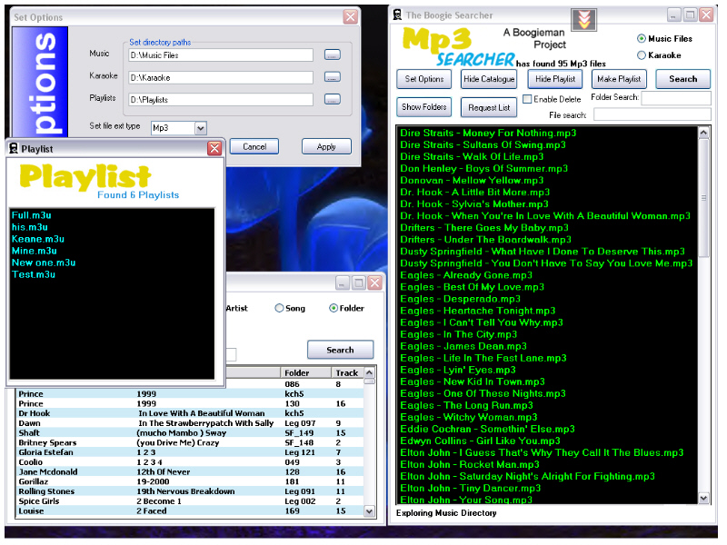



## The Boogie Searcher

### Description

This project was undertaken as a request from a friend of mine who runs a Disco/Karaoke show. He wanted a way to find his Mp3/Karaoke fil quickly -

he has over 12,000 files on his PC! - he also wanted to be able to drag &amp; drop the files straight into his player (He uses VDJ Studio which is ideal for his setup, you can download a demo here http://www.vdj.net

One of his main concerns was the ability to easily see the files and to identify which tracks were Karaoke and which were Music only - his eyesight is not what it was!

The rest of the program's functions were gradually added as the project developed; ie, the Catalogue browser was introduced because not all the Karaoke tracks on his hard drive were titled, they sometimes just have disc &amp; track numbers, so like all Karaoke people he had a comprehensive list as an excel spreadsheet which he used to produce his catalogues with! So I

decided to incorporate a excel reader - which worked - but was too slow, so I converted the excel file to a CSV text file and used the Text file reader,this proved to be very effective and very quick! the listview can also be sorted by clicking the title bars.

The Song Queue,Playlist Maker and Editor were all added at later dates and have proven to be very usefull in a Live situation were speed and reliability are of the essence.

Bits &amp; pieces of this code has been found on various websites, so I cannot take credit for the whole thing - my thanks to those people where ever they may be! - but the main Idea and design I will take credit for!

Hope this is of some use to some of you - I know the DJ's out there should find it very usefull, and if you find any bugs please email me and let me know!

The data text file has been included to demonstrate how the catalogue browser works.

Thanks, Alan (The Boogieman)
 
### More Info
 

             |
---                |---
**Submitted On**   |2007-03-23 13:19:14
**By**             |[Alan Glave](https://github.com/Planet-Source-Code/PSCIndex/blob/master/ByAuthor/alan-glave.md)
**Level**          |Intermediate
**User Rating**    |5.0 (10 globes from 2 users)
**Compatibility**  |VB 5\.0, VB 6\.0
**Category**       |[Sound/MP3](https://github.com/Planet-Source-Code/PSCIndex/blob/master/ByCategory/sound-mp3__1-45.md)
**World**          |[Visual Basic](https://github.com/Planet-Source-Code/PSCIndex/blob/master/ByWorld/visual-basic.md)
**Archive File**   |[The\_Boogie2076377202007\.zip](https://github.com/Planet-Source-Code/alan-glave-the-boogie-searcher__1-69032/archive/master.zip)

